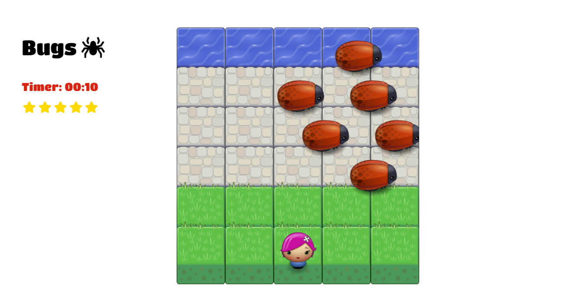

# Classic Arcade Game
Here's a remake of the popular arcade game _Frogger_ only, mine's called _Bugs_.:grin:.

### How To Play
- The aim of this game is to get the player to the water, while also avoiding the enemy bugs.
- Use the arrow keys to move the player left, right, up or down.
- Colliding with an enemy bug resets your position.
- The timer starts when the game does, and your star rating is dependent on how fast you can escape! :smirk:.

### Sample
Here's a sneak-peek of what the game looks like:

## What You Need:
- A browser with good internet connection.
- You may click [here](https://lorlah.github.io/Arcade-Game/) to begin!.
- Please note however, that the game starts immediately it loads.

### Resources Implored
- HTML
- CSS
- JavaScript
- Font Awesome 

### Author
- Salehu Omolola (2018)
