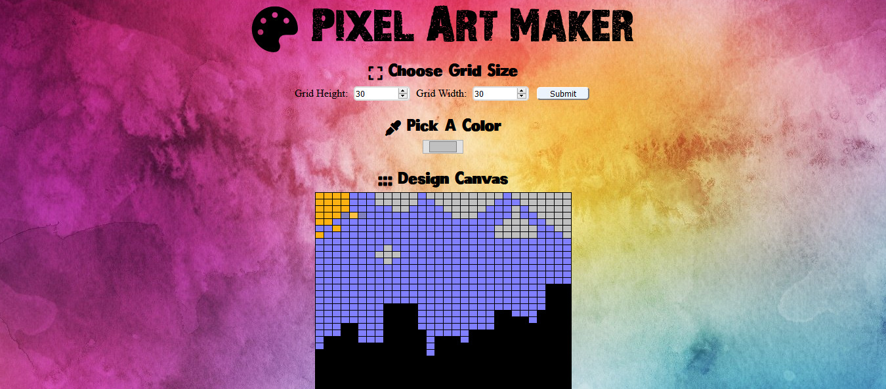

# Pixel Art Maker Project

## Table of Contents

* [Instructions](#instructions)
* [Sample Art](#Sample-Art)

## Instructions

1. To get started, click on this link - https://lorlah.github.io/
2. Choose a grid size for the desired canvas.
3. Select colors of your choice.
4. You could click each singular box or drag the mouse across, whichever you regard as more efficient.
5. Now let loose & create art!

## Sample Art
Here's some sample art made with the project:  
