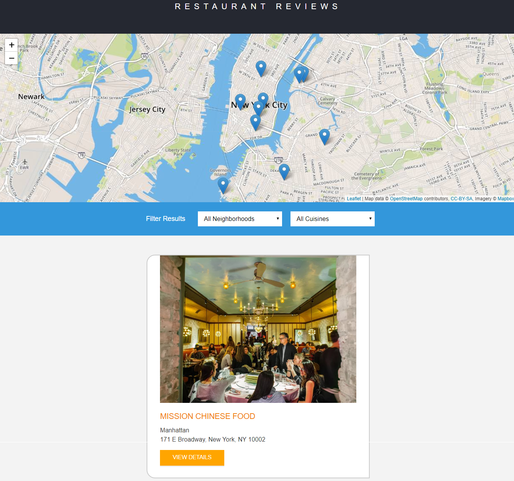

# Restaurant Reviews App

## Project Overview

- This is a website that retrieves data about restaurants from a server. 
- The restaurants' data contains rating information about visited restaurants. 
- The main data structure and images of the website is persisted in cache using a service worker and the restaurant information/list is stored in indexedDB to achieve a good Offline first experience. 
- It functions on any device or screen size.

### Preview
- Here's a preview of the expected features: 

### How To Use
- Click [here](https://lorlah.github.io/RestaurantReviews/) to view the live version of the website.

### Resources Used
- HTML
- CSS3
-  JavaScript ES6
-  Ajax

