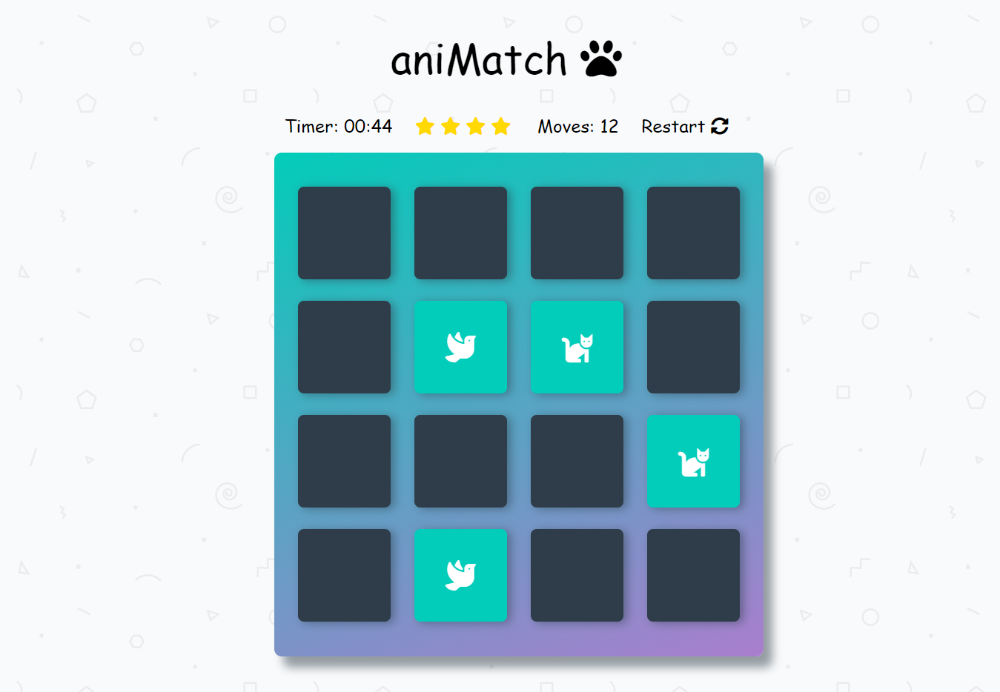

# aniMatch

## Project Description
This game consists of a deck of animal-themed cards which are faced down by default.
All you have to do is click away to match the cards & have tons of fun  while at it!
The game thus ends when you have successfully matched all your cards.
Alright then, have a go.

## Sample
Here's a sample of the expected features:

## What You Need:
- A browser with good internet connection.
- The wit of a three year-old :smirk:.
- You may click [here](https://lorlah.github.io/aniMatch/) to begin!.

## Resources

This project was built with:
- HTML
- CSS
- Vanilla JavaScript
- Font-Awesome

## Author 
- Salehu Omolola (2018).
